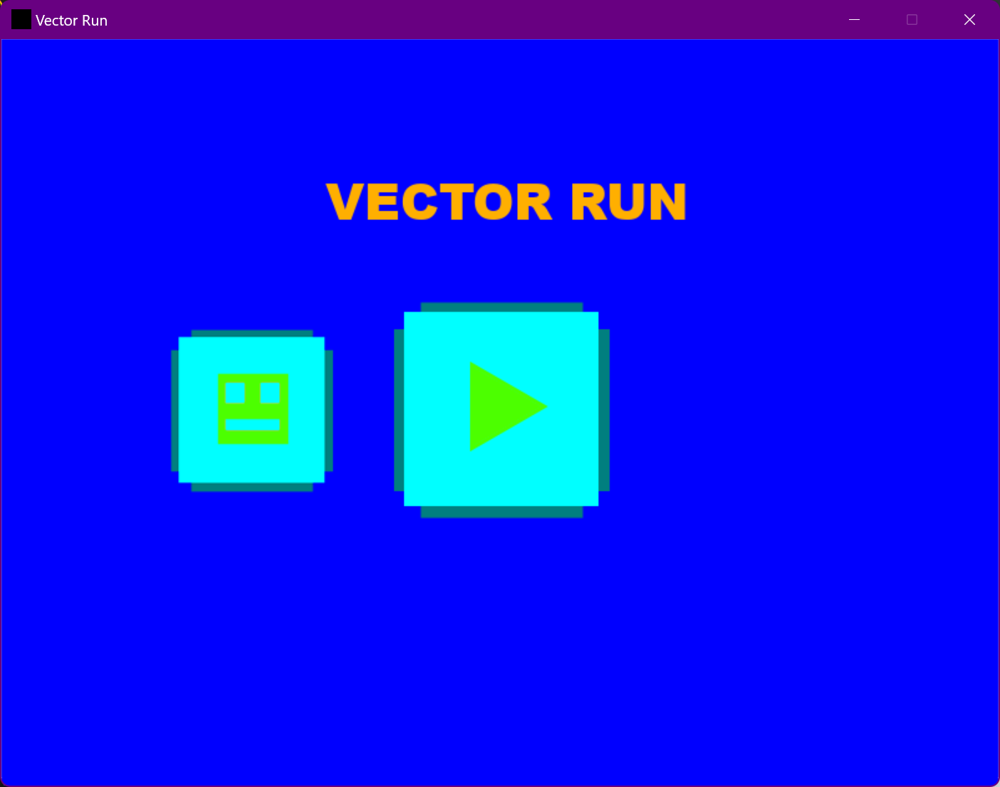
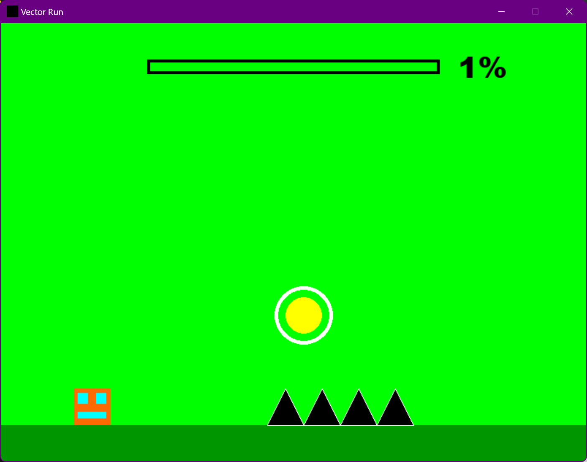
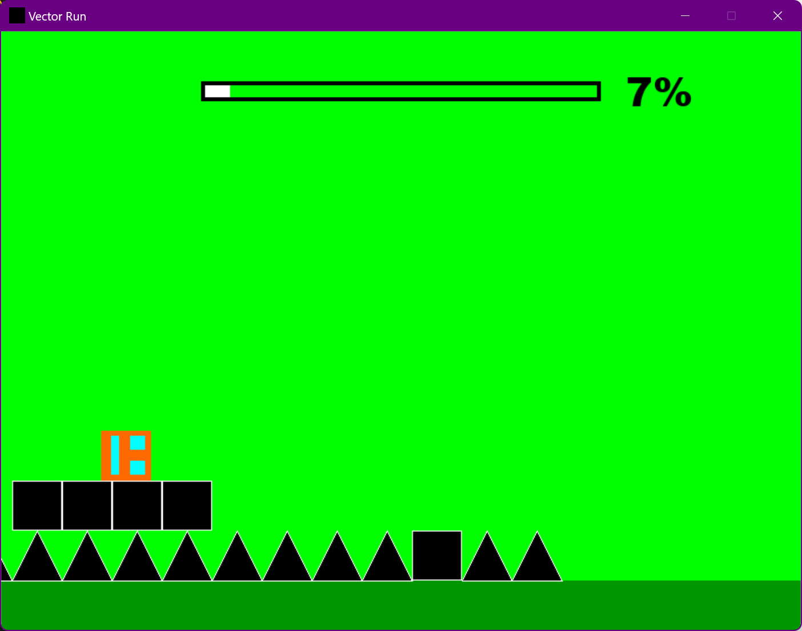

# Description

# 1. Which package/library did you select?

Pygame

# 2. What is the package/library?

Pygame is a game engine for python allowing you to render images to specific coordinates on the screen along with having built in functions for moving things and storing objects to be drawn to the screen, also allowing real time keyboard and mouse input to the window created with pygame. Pygame can be utilized for many things more than just games as it is an excellent library for simply getting input from the user, so making a window with buttons you can click is quite easy, allowing you to have unique windows that can run other programs for a visual gui. Primarily it is used for game development and that is what I had used it for but there are many possibilities with all of the features it has.

# 3. What are the functionalities of the package/library?

[Link to full documentation](https://www.pygame.org/docs/)

Drawing images and text to the screen [ref](https://www.pygame.org/docs/ref/draw.html)

Drawing shapes to the screen, rectangles, polygons, and circles shown here. Also pygame allows you to set a thickness for shapes allowing easy outlining [ref](https://www.pygame.org/docs/ref/draw.html)

Keyboard input [ref](https://www.pygame.org/docs/ref/key.html)
    
    pressed_keys = pygame.key.get_pressed()

Mouse input on buttons [ref](https://www.pygame.org/docs/ref/mouse.html)
    
    pos = pygame.mouse.get_pos()
		if self.rect.collidepoint(pos):
			if pygame.mouse.get_pressed()[0] == 1 and self.clicked == False:
				self.clicked = True
				action = True

