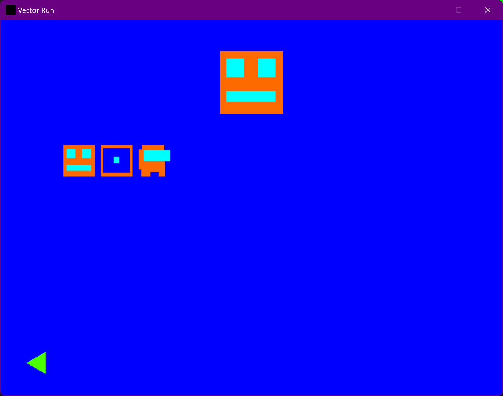
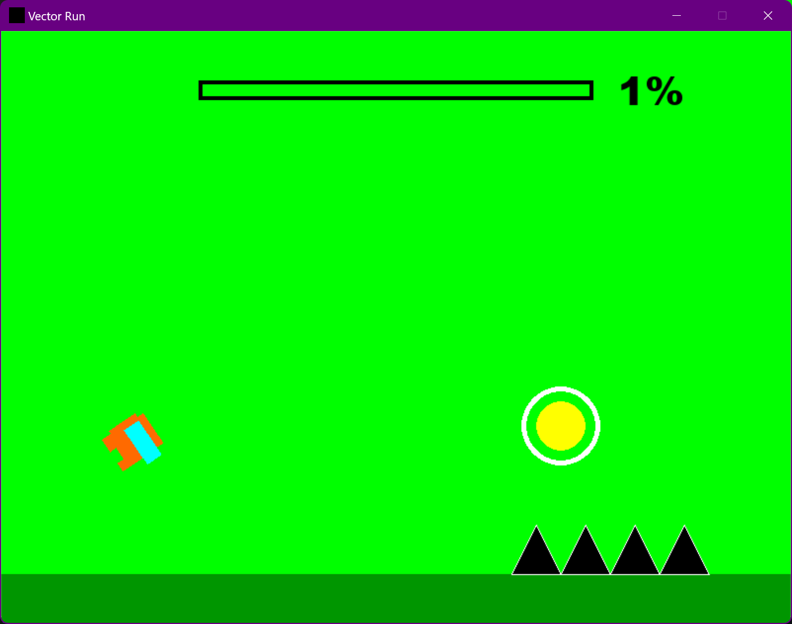

# Description

# 1. Which package/library did you select?

Pygame

# 2. What is the package/library?

Pygame is a game engine for python allowing you to render images to specific coordinates on the screen along with having built in functions for moving things and storing objects to be drawn to the screen, also allowing real time keyboard and mouse input to the window created with pygame. Pygame can be utilized for many things more than just games as it is an excellent library for simply getting input from the user, so making a window with buttons you can click is quite easy, allowing you to have unique windows that can run other programs for a visual gui. Primarily it is used for game development and that is what I had used it for but there are many possibilities with all of the features it has.

# 3. What are the functionalities of the package/library?

[Link to full documentation](https://www.pygame.org/docs/)

Drawing images and text to the screen [ref](https://www.pygame.org/docs/ref/draw.html)

Drawing shapes to the screen, rectangles, polygons, and circles shown here. Also pygame allows you to set a thickness for shapes allowing easy outlining [ref](https://www.pygame.org/docs/ref/draw.html)

Rotate and scale images or shapes [ref](https://www.pygame.org/docs/ref/transform.html)

Keyboard input [ref](https://www.pygame.org/docs/ref/key.html)
    
    pressed_keys = pygame.key.get_pressed()

Mouse input on buttons [ref](https://www.pygame.org/docs/ref/mouse.html)
    
    pos = pygame.mouse.get_pos()
		if self.rect.collidepoint(pos):
			if pygame.mouse.get_pressed()[0] == 1 and self.clicked == False:
				self.clicked = True
				action = True

# 4. When was it created?

October 28th, 2000 [ref](https://www.pygame.org/docs/tut/PygameIntro.html)

# 5. Why did you select this package/library?

I am very interested in game development and have taken CS2053 along with making many games in my free time just to learn more, so pygame stood out to me as a choice to use as I have seen some people use it but never tried it myself. I felt it was a good time to finally attempt to use it to create something. I have coded many small games so creating something to show off the package felt like a good idea and I had a lot of fun while doing it.

# 6. How did learning the package/library influence your learning of the language?

Learning pygame and all the features I had done for this game helped me a lot, I taught myself objects to store all the player data within one place. Along with accessing data in many ways, reading in all files from a directory, and general file parsing.

# 7. How was your overall experience with the package/library?

There are some areas I feel pygame does suffer, but that is most likely due to it being my first time using it and just being accustomed to other engines. I feel like this is a good engine for smaller games but for larger projects performance may suffer. I would definitely recommend this as python in general is a pretty easy language to learn and pygame isn't too complicated so it would be a good entry level game development software. I will most likely continue using it to make some more small projects or continue the project made for this exploration activity as I enjoyed it quite a lot.