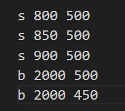
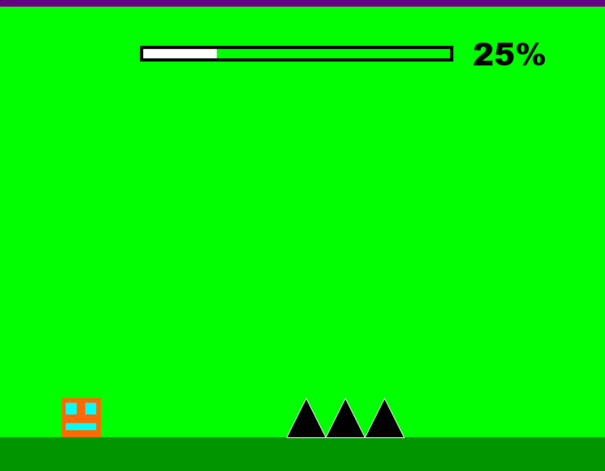

# EA1

# 1. Which Package/library does the sample program demonstrate?

Pygame

# 2. How does someone run your program?

Storing a formatted txt file inside the directory with the game (some provided) or converting a csv to a formatted text file (editor.py does this) allows it to be ran as a level. If you want to create a level I suggest using excel and using Polargeist.csv as a guide

# 3. What purpose does your program serve?

Bringing enjoyment to people. 

# 4. What would be some sample input/output?

## Sample input 

 

## Sample output 

